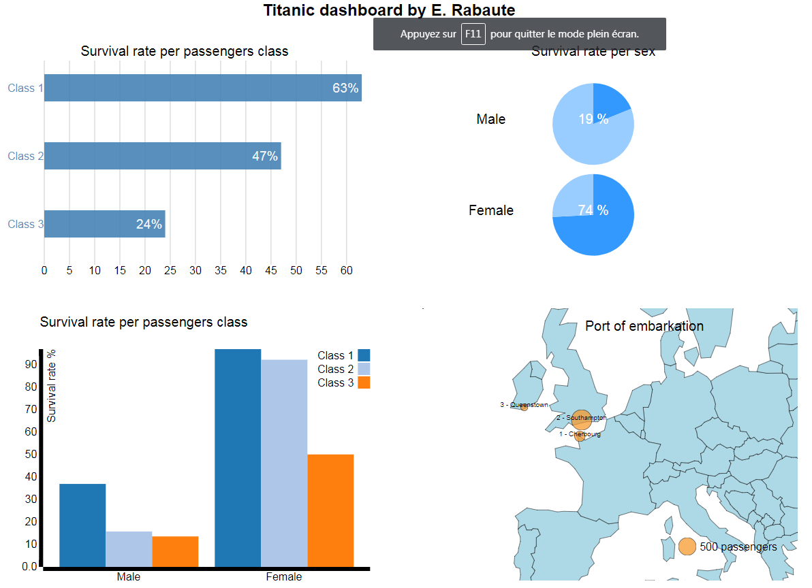

# Titanic Data visualization Project
=======

## Summary

The data I propose to analyse and to visualize is computed from a list of a large sample of Titanic passengers. Many studies and publications are around Titanic disaster, I don't propose to find any clue or hidden facts from this list.
Rather, i prefer to spend time to build one unique synthetic dashboard gathering main facts about who were on that ship and especially who survived and died according social and sex categories.

## Design

To build this dashboard, I tried to apply what I've learnt from Visualization module of Nanodegree program.

I thought that a dashboard with a 4 square box was a good compromise between information to share and readibility of the chart.

For the 4 square box, I decided to create those following charts:
* Top left: Survival rate of passengers according Class ticket
	+ that explains how social category influence on survival chances
	+ Bar chart was the best choice for me to visualize the data
	+ Horizontal and vertical bar charts were possible but as i wanted to add two bar charts in the same dashboard i found more aestethics to have both horizontal and vertical
* Top right: Survival rate of passengers according Sex
	+ that explains how sex ategory influence on survival chances
	+ Pie chart was the best choice for me to visualize the data as only two categories were needed (survived or not)
* Bottom left: Survival rate of passengers according Sex and Class ticket
	+ It is a kind of mix between both first charts but I still added this one as i found it bring added value
	+ Vertical bar chart was the most efficient for this purpose
* Bottom right: Port of embarkation
	+ This chart is used to highlight the fact that nor only passengers embarked from Southampton but even form Queenstown (Ireland) and Cherbourg (France)
	+ Obvisouly, map chart is the most efficient as we can see on one sight where and how many passengers embarked

To build up the dashboard, I didn't want to start from scratch. Instead, I prefered to build the dashboard canvas with 4 charts samples of internet community (see resources section for references).
Then, I customized the code in order to apply to Titanic passengers list story.

I developed the dashboard and validated with a Chrome browser v62, we could face compatibility issues with other browser and/or versions.

## Feedback

1. My first draft is under file: index1.html
* 3 of 4 charts were ready (only the bottom left missed).
* The first feedback was good except for the planned format for the 4th chart (bottom left)
* A proposition was to show the embarkation port on a map that i found very interesting

2. The second draft is under file: index2.html
* I added a map with all embarkation port with circles representing the number of passengers
* The second feedback was good except it was highlighted that this map chart missed a clear legend about size of circle
* The proposition was to add a circle representing 500 passengers to assess size of other circles

## Resources

list any sources you consulted to create your visualization

Example of horizontal bar chart:
http://bl.ocks.org/juan-cb/faf62e91e3c70a99a306

Example of vertical bar chart:
http://bl.ocks.org/juan-cb/ac731adaeadd3e855d26

Example of pie chart:
https://bl.ocks.org/mbostock/1346395

Example of map chart:
Udacity Data Analyst Nanodegree program
https://www.udacity.com/

A [link](http://example.com).

> Markdown uses email-style > characters for blockquoting.

Inline <abbr title="Hypertext Markup Language">HTML</abbr> is supported.
